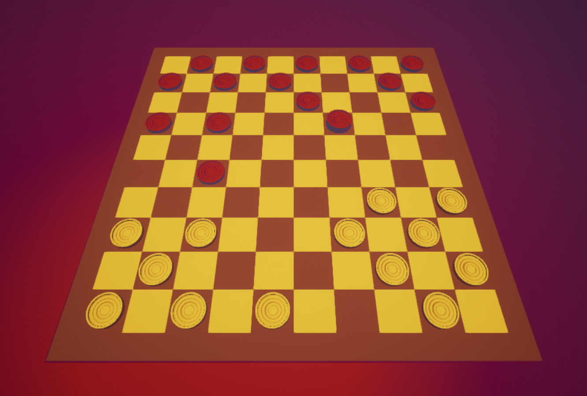

This is an Unreal Engine 5 implementation of international checkers.
I worked on it leisurely over the course of two months to learn to work with Unreal.
By default, this uses an international checkers ruleset, but you can also
make it play English draughts or a few other versions of checkers by changing
this line in `CheckersState.cpp`:
```c++
rules = INTERNATIONAL_CHECKERS;
```
See also `CheckersRules.h` for the possible settings.

I also used this project to try out a few things with C++ code styles.
I wrote a blog post about the style I've used for this project,
which you can read on
[z.vandillen.dev/2022/03/17/quirky-cpp-codestyle](https://z.vandillen.dev/2022/03/17/quirky-cpp-codestyle/).
However you should know I made a few of the macros neater while writing the
article, so the versions used for this project are slightly outdated.

I'm generally quite satisfied with the quality of code
I achieved in this project.
It's not perfect by any means, but I somewhat like the way the code looks.
Over the course of this project I've learned that implementing checkers
is more difficult than you'd expect, since there's numerous
rules concerning chaining attacks that I wasn't previously aware of.

By the way, the project is called "CheckersAgain" in the code because I first
tried making a checkers game with Unreal blueprints,
which is Unreal Engine's visual scripting language.
After finding out that blueprints are
a bit too tedious for any serious amount of programming
work, I decided to start afresh.
Hence the name "CheckersAgain" for this project.
